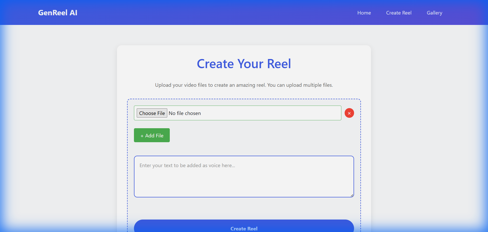

# VidSnap.ai (GenReel AI)

**Generate Amazing Instagram Reels with AI**

VidSnap.ai is an automated tool that turns your images and text into engaging vertical videos (Reels/TikToks) using AI-powered VoiceOver and FFmpeg video processing.


## 🚀 Features

-   **Upload Multiple Images**: Select images to feature in your reel.
-   **AI VoiceOver**: Input text to generate high-quality voiceovers using ElevenLabs AI.
-   **Automatic Assembly**: Seamlessly stitches images and audio into a vertical format (1080x1920) perfect for social media.
-   **Background Processing**: Dedicated background worker to handle video generation without blocking the main website.



## 🛠️ Technology Stack

-   **Frontend/Backend**: Python, Flask, HTML/CSS
-   **AI Text-to-Speech**: ElevenLabs API
-   **Video Processing**: FFmpeg
-   **Dependencies**: `flask`, `elevenlabs`

## 📋 Prerequisites

Before you begin, ensure you have the following installed:

1.  **Python 3.x**
2.  **FFmpeg**: Must be installed and added to your system's PATH.
    *   To verify, run: `ffmpeg -version`
3.  **ElevenLabs API Key**: You need an active API key from [ElevenLabs.io](https://elevenlabs.io/).

## ⚙️ Installation

1.  **Clone the Repository**
    ```bash
    git clone <your-repo-url>
    cd VidSnap.ai
    ```

2.  **Install Python Dependencies**
    ```bash
    pip install -r requirements.txt
    ```

3.  **Configure API Key**
    *   Open `config.py`.
    *   Replace the placeholder key with your actual ElevenLabs API key:
        ```python
        ELEVENLABS_API_KEY="your_actual_api_key_here"
        ```

## 🏃 Run the Application

This project requires two active terminal processes to function fully: one for the web server and one for the video processing worker.

1.  **Start the Web Server**
    ```bash
    python main.py
    ```
    The app will run at: `http://127.0.0.1:5000`

2.  **Start the Background Worker** (in a new terminal window)
    ```bash
    python generate_process.py
    ```
    This script listens for new uploads and processes the video creation.

## 📖 Usage

1.  Open `http://127.0.0.1:5000` in your browser.
2.  Click on **"Create Reel"**.
3.  Enter a unique ID (or leave default).
4.  Type the text you want the AI to speak.
5.  Select one or more images (`.jpg`, `.png`).
6.  Click **"Create Reel"**.
7.  The `generate_process.py` script will pick up the job, generate the audio, and create the video in `static/reels`.
8.  Go to the **"Gallery"** page to view your created reels!

## 🤝 Contributing

Contributions are welcome! Please feel free to submit a Pull Request.
